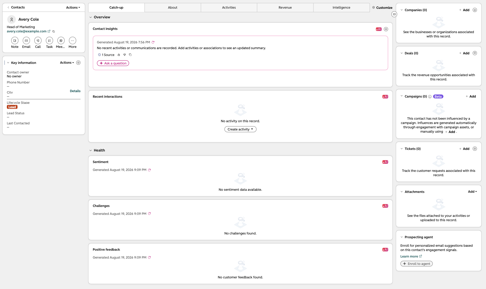
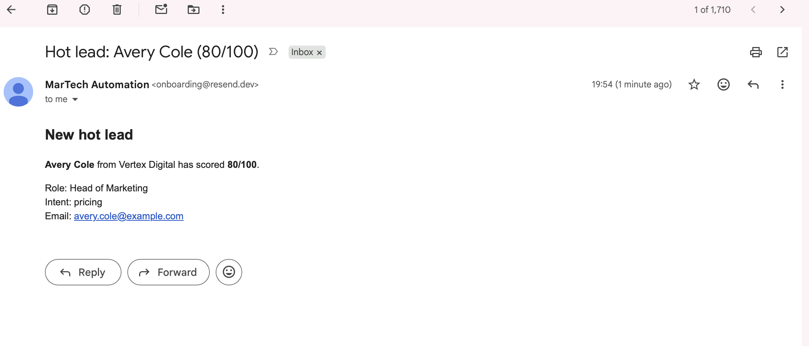
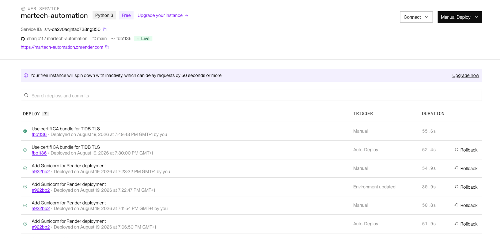

# MarTech Automation & Lead Management System

A cloud-hosted marketing automation system that captures, scores and prioritises inbound leads, then orchestrates CRM and sales-notification workflows through live HubSpot and Resend integrations.

The project demonstrates how marketing technology, data and automation can be connected to improve lead management and create a reliable handoff between marketing and sales.

## Live Demo

🌐 **Live application:** https://martech-automation.onrender.com/

Submit a test lead to see the end-to-end workflow in action, including lead scoring, CRM activation and automated sales notification.

## Overview

Marketing teams often capture leads across multiple channels, but turning those leads into timely and actionable sales opportunities requires several systems to work together.

This project creates an end-to-end workflow that:

1. Captures lead data through a REST API.
2. Scores and categorises leads based on profile and intent data.
3. Generates appropriate automation tasks.
4. Creates or updates contacts in HubSpot CRM.
5. Sends priority lead notifications through Resend.
6. Records automation events and provider activity for monitoring and troubleshooting.
7. Stores lead and automation data in a cloud-hosted relational database.

The application supports both **test** and **live** integration modes, allowing workflows to be validated safely before real provider calls are enabled.

## Architecture

```text
                         ┌──────────────────────┐
                         │   Lead / API Input   │
                         └──────────┬───────────┘
                                    │
                                    ▼
                         ┌──────────────────────┐
                         │    Flask REST API    │
                         │    Hosted on Render  │
                         └──────────┬───────────┘
                                    │
                                    ▼
                         ┌──────────────────────┐
                         │ Lead Scoring Engine  │
                         │ Hot / Warm / Cold    │
                         └──────────┬───────────┘
                                    │
                                    ▼
                         ┌──────────────────────┐
                         │ Automation Engine    │
                         │ Tasks + Retry Logic  │
                         └──────┬────────┬──────┘
                                │        │
                   ┌────────────┘        └────────────┐
                   ▼                                  ▼
        ┌─────────────────────┐            ┌─────────────────────┐
        │     HubSpot CRM     │            │       Resend        │
        │ Create/Update Lead  │            │ Hot Lead Email      │
        └──────────┬──────────┘            └──────────┬──────────┘
                   │                                  │
                   └────────────────┬─────────────────┘
                                    ▼
                         ┌──────────────────────┐
                         │ Provider/Audit Logs  │
                         └──────────┬───────────┘
                                    │
                                    ▼
                         ┌──────────────────────┐
                         │     TiDB Cloud       │
                         │ Leads / Tasks / Logs │
                         └──────────────────────┘
```

## Live Workflow

A lead submitted to the application is evaluated by the scoring engine and assigned a score and category.

For example, a high-intent lead can be classified as:

```text
Score: 80/100
Category: Hot
```

The automation engine then creates priority tasks. For a hot lead, the live workflow can:

- create or update the contact in **HubSpot CRM**;
- send a priority notification through **Resend**;
- record the result of each provider call;
- track task status and retry attempts.

The complete workflow has been tested successfully in the deployed cloud environment using live HubSpot and Resend integrations.

## Technology Stack

| Area | Technology |
|---|---|
| Application | Python, Flask |
| API | REST |
| ORM | SQLAlchemy / Flask-SQLAlchemy |
| Database | TiDB Cloud (MySQL-compatible) |
| Database Driver | PyMySQL |
| CRM | HubSpot |
| Email | Resend |
| HTTP Integrations | Requests |
| Production Server | Gunicorn |
| Hosting | Render |
| Local Development | Docker / Docker Compose |
| Testing | Pytest |
| Source Control | Git / GitHub |
| Configuration | Environment variables / python-dotenv |
| TLS | Certifi |

## Lead Scoring & Prioritisation

The application evaluates lead attributes such as:

- company size;
- job title;
- source;
- expressed intent.

The resulting score is used to categorise the lead as **hot, warm or cold**.

This enables different automation actions to be triggered based on lead quality rather than treating every inbound enquiry identically.

## Automation & CRM Integration

The automation layer generates tasks linked to each lead.

Tasks include:

- priority sales follow-up;
- HubSpot contact creation/update;
- hot-lead email notification.

Each task tracks operational information including:

- status;
- priority;
- attempts;
- maximum retry attempts;
- due date;
- completion time;
- last error.

This provides a basic orchestration layer rather than making provider API calls directly from the initial lead request.

## Integration Modes

The application supports two modes:

```text
INTEGRATION_MODE=test
```

Test mode allows integration behaviour to be validated without making live provider calls.

```text
INTEGRATION_MODE=live
```

Live mode enables real HubSpot and Resend API requests.

The active configuration can be checked through:

```text
GET /integrations/status
```

## Audit & Provider Logging

External integration activity is recorded in provider logs.

Logs capture information including:

- provider;
- operation;
- integration mode;
- success/failure status;
- HTTP status;
- external provider ID;
- request/response information;
- error details;
- timestamp.

This creates visibility into what happened after an automation task was processed and supports troubleshooting of failed integrations.

## Cloud Database

The deployed application uses **TiDB Cloud**, a MySQL-compatible cloud database.

The core data model contains:

```text
leads
automation_tasks
automation_events
provider_logs
```

Relationships between these tables allow automation activity and external-provider interactions to be traced back to the originating lead.

Secure TLS is used for the application-to-database connection.

## API Endpoints

Key endpoints include:

```text
GET  /health
GET  /integrations/status

POST /leads
GET  /leads

GET  /leads/<id>/automation
GET  /leads/<id>/provider-logs

GET  /provider-logs
GET  /automation/tasks

POST /automations/process
POST /automation/tasks/<id>/retry

POST /webhooks/leads
POST /webhooks/test-signature

POST /maintenance/legacy-sales-tasks/requeue
```

## Example End-to-End Flow

A test of the production deployment created a high-intent lead with:

```text
Job title: Head of Marketing
Company size: 1,400
Intent: Pricing
Lead score: 80
Category: Hot
```

The hosted application then:

```text
Created lead in cloud database
        ↓
Generated 2 priority automation tasks
        ↓
Processed tasks in live integration mode
        ↓
HubSpot contact created successfully
        +
Resend notification delivered successfully
        ↓
2 tasks completed
0 tasks failed
```

The contact and email delivery were subsequently verified in their respective platforms.


## Live Integration Results

The production workflow has been validated end-to-end using the cloud-hosted application.

### HubSpot CRM

A high-intent lead processed by the automation engine was successfully created in HubSpot CRM.



### Automated Hot-Lead Notification

The same workflow triggered a priority sales notification through the Resend email integration.



### Cloud Deployment

The Flask application is deployed as a live web service on Render, with TiDB Cloud providing the persistent database layer.




## Reliability & Error Handling

The automation layer includes:

- task status tracking;
- retry attempts;
- maximum retry limits;
- provider response logging;
- error capture;
- legacy-task compatibility handling;
- test/live integration separation.

This makes failures visible and recoverable rather than silently losing automation activity.

## Security

Sensitive configuration is managed using environment variables.

Credentials such as:

```text
HUBSPOT_ACCESS_TOKEN
RESEND_API_KEY
DB_PASSWORD
WEBHOOK_SECRET
```

are excluded from source control.

The repository contains `.env.example` for configuration structure, while real credentials are stored locally or as secure environment variables within the hosting environment.

Database connections use TLS certificate verification.

## Running Locally

Create and activate a virtual environment:

```bash
python3 -m venv .venv
source .venv/bin/activate
```

Install dependencies:

```bash
pip install -r requirements.txt
```

Create the local environment configuration:

```bash
cp .env.example .env
```

Configure the required environment variables, then start the application:

```bash
python -u app.py
```

The local API runs at:

```text
http://127.0.0.1:5001
```

## Testing

The project includes automated tests covering the lead and automation functionality.

Run:

```bash
pytest
```

Live integrations can also be validated through provider logs and the external HubSpot and Resend platforms.

## What This Project Demonstrates

This project combines marketing operations and software engineering concepts, including:

- MarTech architecture;
- marketing-to-sales handoff;
- lead scoring and prioritisation;
- CRM integration;
- workflow automation;
- REST API development;
- cloud database design;
- third-party API integration;
- audit logging;
- retry/error handling;
- environment and secrets management;
- cloud deployment;
- test-to-production integration workflows.

The aim is not simply to automate an email or CRM update, but to demonstrate how a maintainable MarTech integration layer can connect marketing data, decision logic and downstream platforms.
